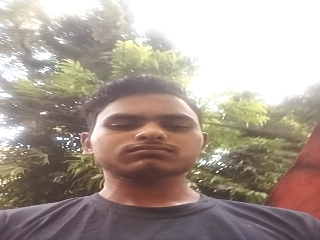

# 📸 Camera + Location Consent Demo

A small local demo app that captures camera images and location **only after explicit user consent**.

## Run locally

```bash
chmod +x run.sh
./run.sh
```

Then open: `http://localhost:9090`

## Endpoints

- `GET /` → consent demo UI
- `POST /upload` → save camera image in `photos/`
- `POST /log` → append location to `location_log.txt`
- `GET /gallery` → view saved images

## Sample photos (GitHub preview)

These sample images are already part of the repository and will render directly on GitHub:




## Notes

- This project is for local demo/testing use.
- Do not use it for deceptive or unauthorized data capture.
